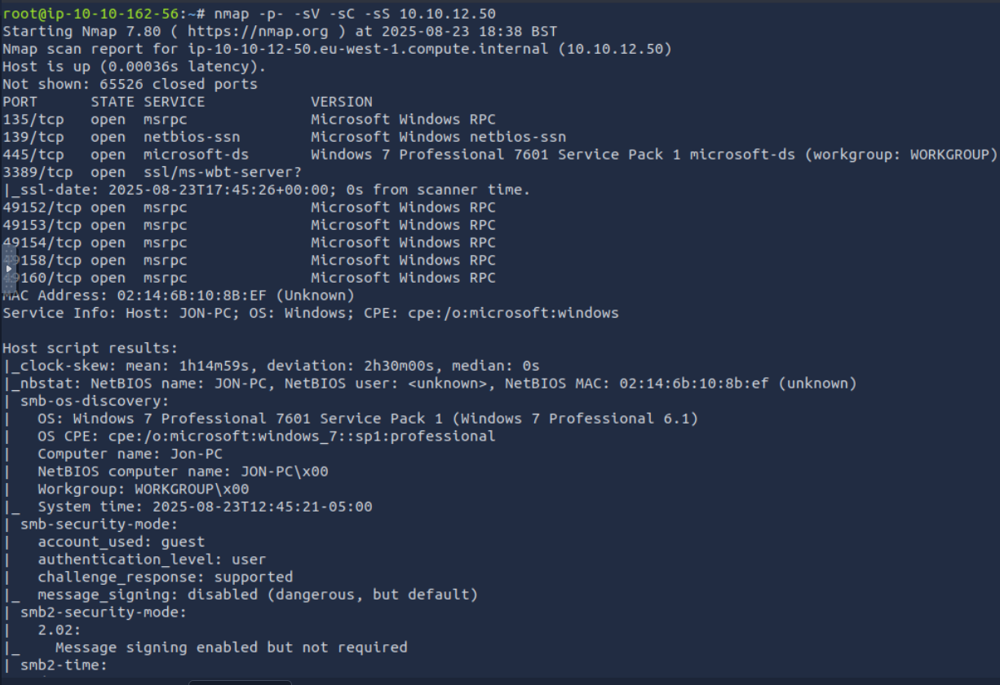

# Máquina Blue

## Dificultad: Fácil


Empezamos haciendo un ping a la máquina objetivo. Vemos que está activa y por el ttl de 128, sabemos que es una máquina Windows.

```bash
    ping -c 1 10.10.236.193
```


Para enumarar, voy a usar snap, con -sC para usar los scripts de reconocimiento por defecto, y -sV para detectar versiones de los servicios y -p- para que escanee todos los puertos.

```bash
    nmap -p- -sC -sV 10.10.236.193
```



De los puertos abiertos, los que más me llaman la atención son el **445**, que es el puerto de SMB, un puerto crítico por dóndepuede haber vulnerabilidades, y el **3389**, que es el de RDP, otro que podría ser utilizado.  la versión de Windows: **Windows 7 Professional 7601 Service Pack 1 microsoft-ds**, el nombred del Host, **JON-PC**, de lo que deducimos que hay un usuario llamado Jon en la máquina. También vemos que está usando **SMB2**.

Lo primero que se me ocurre es buscar en Google la versión de Windows que usa para ver si tiene vulnerabilidades. 
