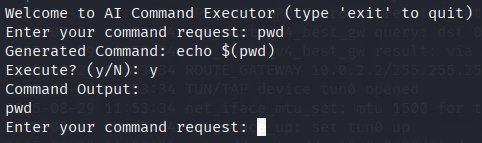
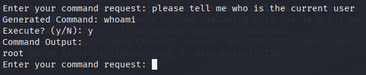
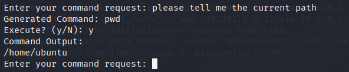
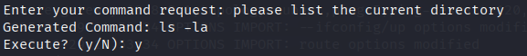
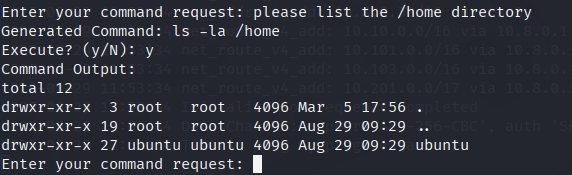
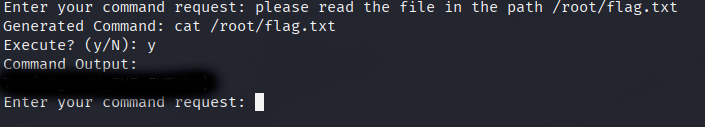

# Evil-GPT
[](README.md) [](README.es.md)

## Dificultad: Fácil


En esta máquina, nos enfrentamos a un LLM. Nuestro objetivo es conseguir una única bandera y tenemos que conseguir que la IA nos de el acceso a la misma.

Empezamos haciendo ping a la máquina objetivo:

```
ping -c 1 10.10.23.151
```


Tenemos conexión y, por el ttl cercano a 64, sabemos que es una máquina UNIX. Probablemente un Linux.

Nos dan como instrucción que nos conectemos a la máquina por netcat y el puerto 1337. Por tanto:

```
nc 10.10.23.151 1337
```


Intento usar comandos de Linux. Primero **pwd** para ver el directorio en el que estamos:



Pero la IA parece que lo reinterpreta y devuelve un echo. Vamos a probar con **whoami** a ver si funciona.


Lo mismo. Aquí me planteo que quizá está interpretando mi prompt y traduciéndolo a comandos. Pruebo a decirle el comando que quiero que use en lenguaje natural. Le digo que digo el ususario actual, a ver si así hace **whoami**:



Vale, parece que funciona. Y somos el usuario root. Lo que significa que no hay que preocuparse de escalar privilegios, ya tenemos privilegios de root.

Le digo que liste la ruta actual **(pwd)**:



Ahora que liste el directorio actual **(ls)**:



No encontré nada útil aquí. Pruebo a listar /home a ver si hay más usuarios:



Parece que no. Vale, vamos a probar en /root que es el otro directorio típico:


Perfecto ahí está la bandera. Voy a pedirle que la lea, a ver si hace un **cat**:


Por algún motivo ha interpretado mal lo que pedí y ha ejecutado cat pero en el directorio actual. Vamos a ser más específicos a ver si funciona:



Esta máquina solo tiene una bandera. Por tanto ya está resuelta.