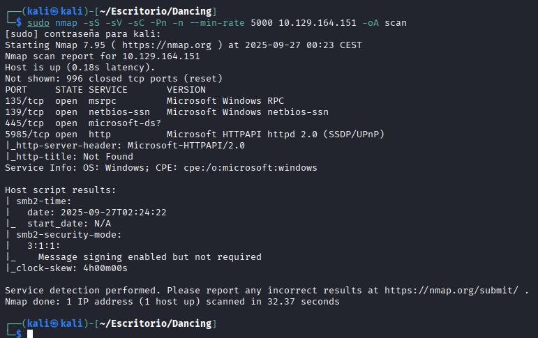
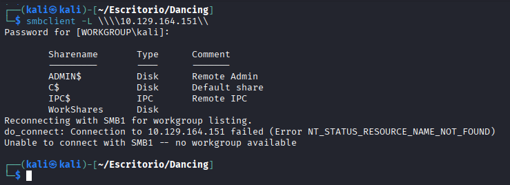
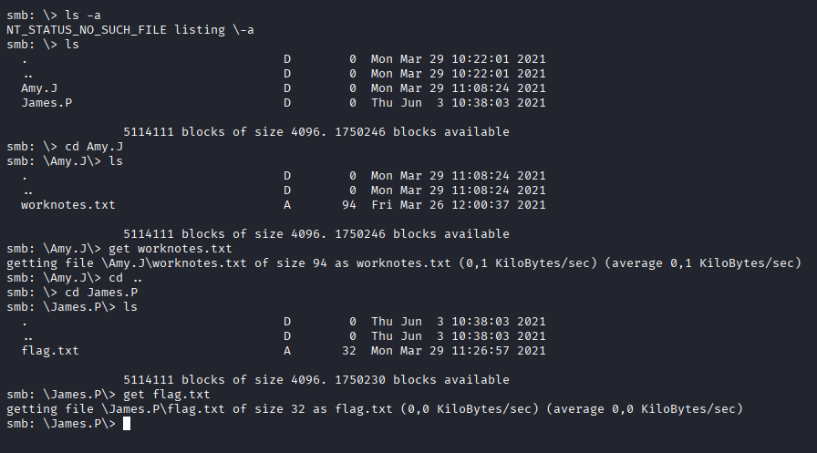
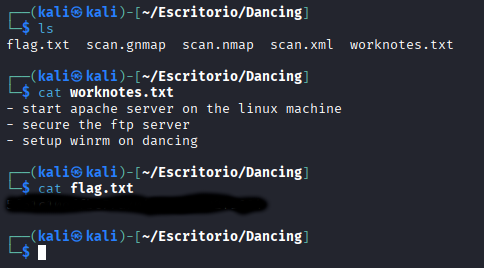

# Dancing
[](README.md) [](README.es.md)

## Dificultad: Muy Fácil


Primero lanzo un nmap para enumerar los puertos:

```
sudo nmap -sS -sV -sC -Pn -n --min-rate 5000 10.129.164.151 -oA scan
```


Enumero los recursos compartidos del SMB:

```
smbclient -L \\\\10.129.164.151\\
```



Intento acceder sin contraseña a cada uno de los recursos compartidos, finalmente funciona con WorkShares:

```
smbclient \\\\10.129.164.151\\WorkShares
```


Busco en los distintos directorios hasta que encuentro la bandera:




Me desconecto del SMB y leo la bandera:


