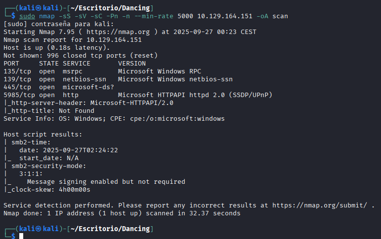
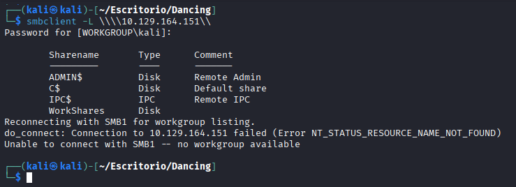
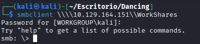
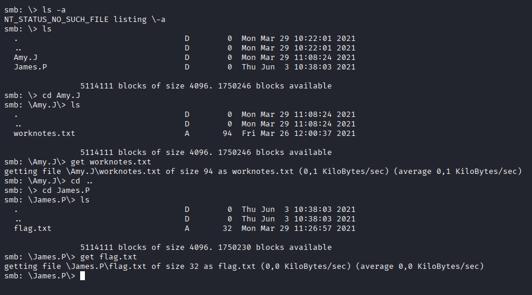
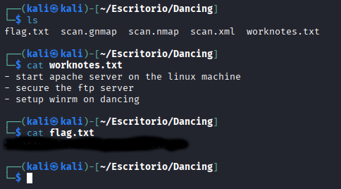

# Dancing
[](README.md) [](README.es.md)

## Difficulty: Very Easy


I run nmap to enumerate the ports:

```
sudo nmap -sS -sV -sC -Pn -n --min-rate 5000 10.129.164.151 -oA scan
```


I enumerate the SMB shares

```
smbclient -L \\\\10.129.164.151\\
```



I try to join without passwords to the shares, it works with WorkShares:

```
smbclient \\\\10.129.164.151\\WorkShares
```



I search until I find the flag:




I log out the SMB and read the flag:


