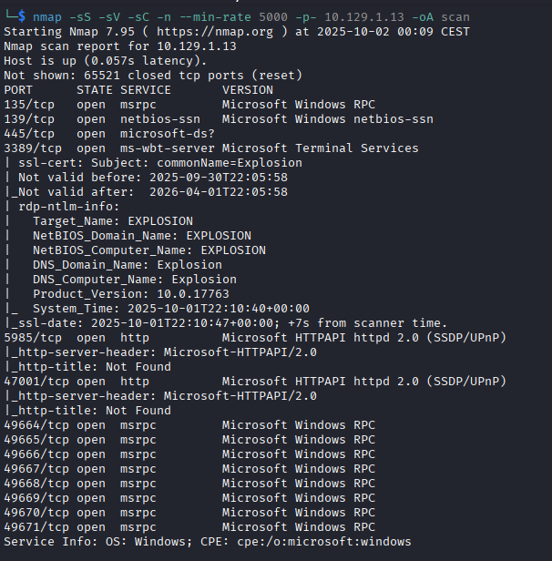
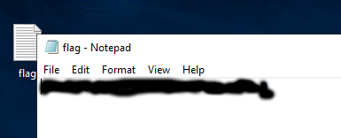

# Explosion
[](README.md) [](README.es.md)

## Dificultad: Muy Fácil


Hago ping para comprobar conectividad:

```
ping -c 1 10.129.1.13
```


Hago un escaneo de puertos con nmap:

```
nmap -sS -sV -sC -n --min-rate 5000 -p- 10.129.1.13 -oA scan
```



Hack The Box aquí te hace un montón de preguntas relacionadas con RDP así que es obvio que esto va de explotar el RDP.

En una de esas preguntas, te preguntan cual es el usuario que puede logearse sin contraseña, así que es obvio que hay que intentar eso. Usando xfreerdp, hago un primer intento sin poner usuario, no funciona, el segundo intento pongo la cuenta de Admisitrador, Administrator en inglés, y funciona:

```
xfreerdp3 /u:administrator /v:10.129.1.13:3389
```


La flag está en el escritorio:


