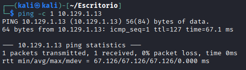
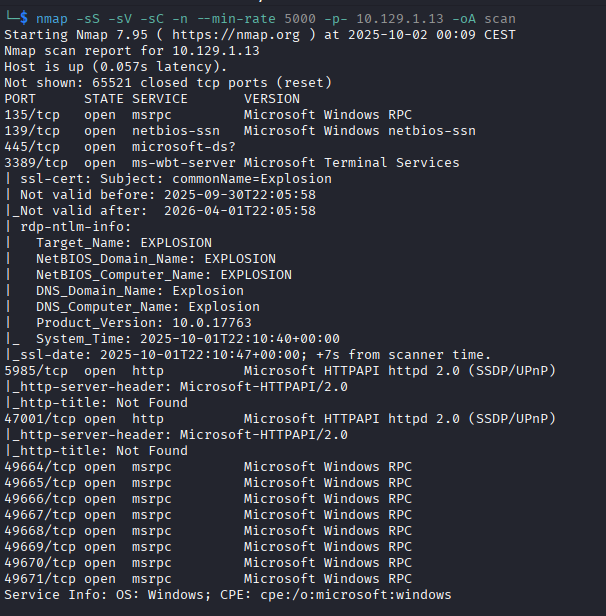
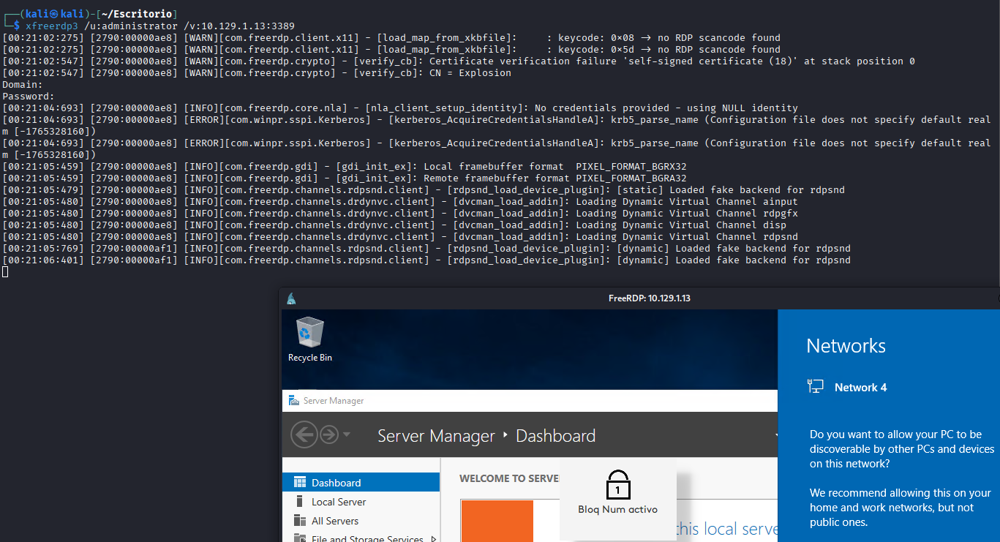
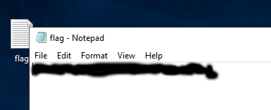

# Explosion
[](README.md) [](README.es.md)

## Difficulty: Very Easy


I ping the target to test the connection:

```
ping -c 1 10.129.1.13
```



I run nmap to scan ports:

```
nmap -sS -sV -sC -n --min-rate 5000 -p- 10.129.1.13 -oA scan
```



Hack The Box asks you a lot of questions about RDP here, so it's obvious that the machine is about exploiting RDP.

In one of those questions, they ask you which user can log in without a password, so obviously need to try that. Using xfreerdp, I try the first one without user but it doesn't work. The second try, I type the Administrator account, and it works:

```
xfreerdp3 /u:administrator /v:10.129.1.13:3389
```



The flag is on the Desktop: 


