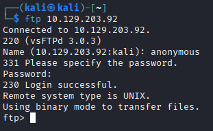
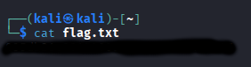

# Fawn
[](README.md) [](README.es.md)

## Dificultad: Muy Fácil


Empiezo usando nmap para enumerar los puertos de la máquina:

```
sudo nmap -sS -sV -sC -n --min-rate 5000 -p- 10.129.203.92 -oA scan
```


Vemos que el login como anónimo en el servidor FTP está habilitado. Por tanto voy a hacerlo a ver qué puedo conseguir

```
ftp 10.129.203.93
user: anonymous
```



Cuando pide contraseña, simplemente pulso Enter.

Compruebo mi ruta, listo los directorios, veo que está la bandera y la descargo:

```
pwd
ls -a
get flag.txt
```


Me deslogeo del FTP y leo el contenido de la bandera:

```
cat flag.txt
```

