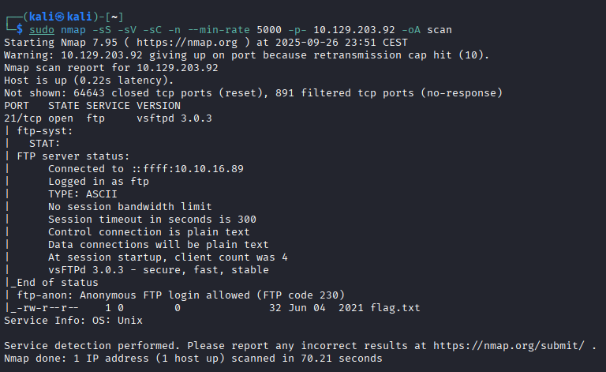
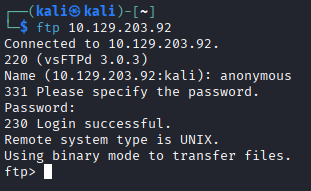
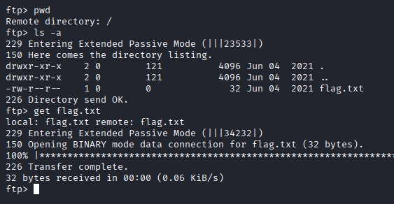
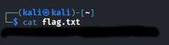

# Fawn
[](README.md) [](README.es.md)

## Difficulty: Very Easy


I start using nmap to enumerate the ports:

```
sudo nmap -sS -sV -sC -n --min-rate 5000 -p- 10.129.203.92 -oA scan
```



Anonymous login is enabled. Si I do it to see what can I get:

```
ftp 10.129.203.93
user: anonymous
```



When it ask for a Password. I just type Enter

I check my path, list the directories, I see the flag and download it:

```
pwd
ls -a
get flag.txt
```



Finally, I log out of the FTP and read the flag:

```
cat flag.txt
```

