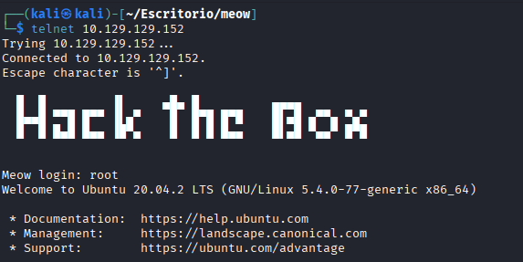

# Meow
[](README.md) [](README.es.md)

## Difficulty: Very Easy


I start with a ping:

```
ping -c 1 10.129.129.152
```


Now I do a quick scan with nmap and save it into a txt file:

```
sudo nmap -sS -sV -sC -T4 -O 10.129.129.152 -oN nmap.txt
```


Because it's a very easy machine, I try to login with the root user by telnet.

```
telnet 10.129.129.152
```



It was very easy, it's the introductory machine to Hack The Box for a good reason, now I just search the flag:

```
ls
cat flag.txt
```


Solved.