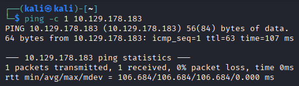
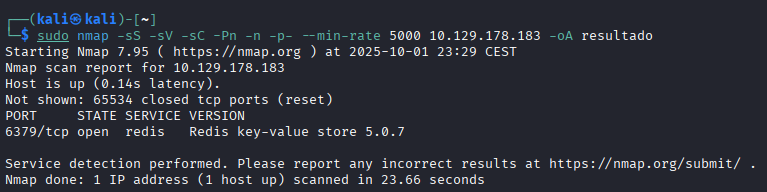
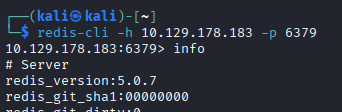
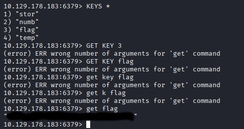

# Redeemer
[](README.md) [](README.es.md)

## Dificultad: Muy Fácil


Hago un ping para verificar la conexión:

```
ping -c 1 10.129.178.183
```



Hago la enumeración con nmap:

```
sudo nmap -sS -sV -sC -Pn -n -p- --min-rate 5000 10.129.178.183 -oA resultado
```



Soo encuentra el servicio de redis. Intento conectar sin contraseña:



No sabía nada de redis, así que busqué lo básico de cómo funciona, y me levó un rato de ensayo y error entenderlo y poder sacar la flag:

