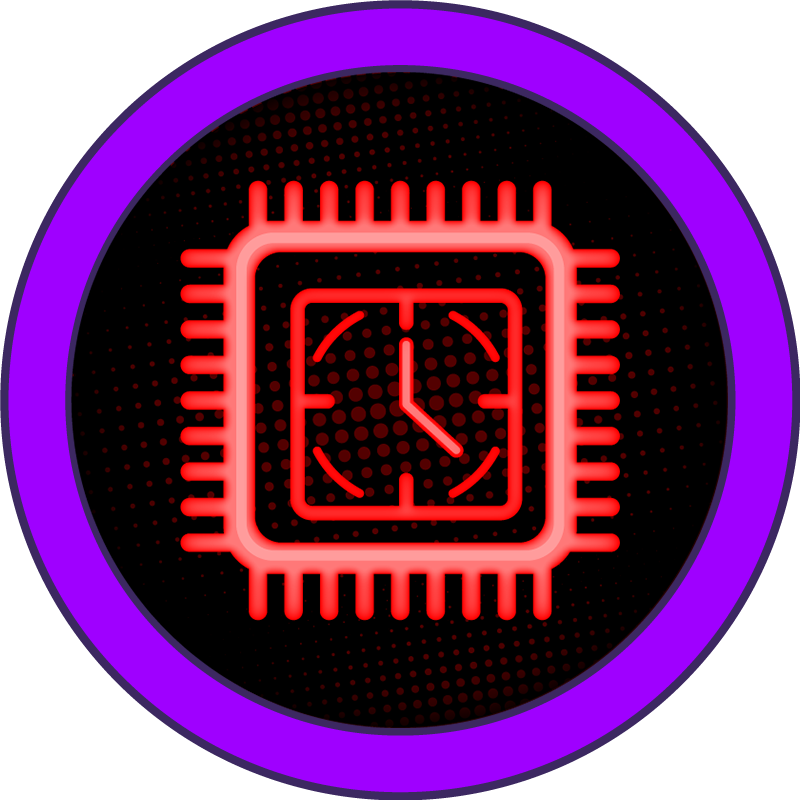

# Redeemer
[](README.md) [](README.es.md)

## Difficulty: Very Easy



I make a pin to test connection:

```
ping -c 1 10.129.178.183
```


I run nmap to enumerate:

```
sudo nmap -sS -sV -sC -Pn -n -p- --min-rate 5000 10.129.178.183 -oA resultado
```


I only found redis. I try to connect without password:


I didn't know anything about redis, so I searched the basics of how redis works, and it took me a bit of trial and error to understand it and be able to get the flag:

