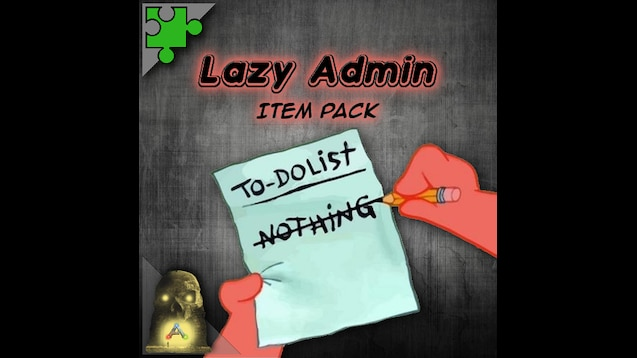

# LazyAdmin
[](README.md) [](README.es.md)

## Difficulty: Easy



I start with a ping to check the connection

```
ping -c 1 10.10.176.70
```


It's works. And for the ttl close to 64, it's a Linux Machine.

I use nmap to scan for open ports
```
nmap -p- -sV -sC -sS -vvv 10.10.176.70
```


Ports 80 (HTTP) and 22 (SSH) are open. So it's a website. I check the web:


It's shows the Apache's default page.

I run gobuster to fuzz for hidden directories
```shell
gobuster dir -w /usr/share/wordlists/dirbuster/directory-list-2.3-medium.txt -u http://10.10.176.70/ -x txt,js,html,php
```


I check content:


It seems this website uses a CMS called SweetRice, which I've never heard of before.

I can't find nothing more interesting, so I run gobuster and iterate over /content to search for more subdirectories:


In /content/inc I find an index with the server's files:


Searching the index, I find a backup of a SQL database. You can find all kinds of confidential information in a database, so I download it.


In /content/as I found the Login Portal:


I open the database with a text editor. Because a .sql file can be read in plain text. This is the create  of a MySQL table. The interesting line is this:


It's an INSERT. And, if we look closely, we see that admin is "manager" and passwd is that long number. The first thing I do is try the credentials as is, but it doesn't work. Then I open Cyberchef to see if it's encrypted, but I failed again. The other option I can think of is that it's a hash.


I use hashid, which tells us from highest to lowest what type of hash it is most likely to be, if it is a hash.


I use John the Ripper with rockyou.txt.

First I create a file and write the hash to it with an echo:


Now let's try John the Ripper. First I tried md2 but it didn't work, then I tried md5 and it worked:

```
john --wordlist=/usr/share/wordlists/rockyou.txt --format=raw-md5 hash.txt
```


We now have the password. I try it with "manager" as the username, and it works:


So the SweetRice's version is 1.5.1. I've Googled to see if it has any known vulnerabilities, and it's vulnerable to Arbitrary File Upload. So, knowing that and the fact that it has many directories accessible from outside, I should be able to set up a reverse shell to access it through the terminal.


I used [pentestmonkey](https://github.com/pentestmonkey/php-reverse-shell) PHP Reverse Shell

Just need to change the IP to ours. You can use **ip a** command to know the IP. And a random port that is not used.


I set netcat to listen on port 4444:

```shell
nc -lvnp 4444
```


Now we need to upload the reverse shell and send a GET request to it so the server activates the script and we can have the reverse shell. I tried uploading the file in different places. I tried it in media, making a post, but it wouldn't let me upload it. I tried other extensions and it did let me. So the problem is that it won't let me upload .php files.

I kept searching and in Ads, I saw that I could upload embedded code:


I decide to paste the script here to see if it's uploading somewhere accessible.


Okay it just uploaded. Time to try:


Perfecto. So I click it to send the GET request to the server. And it works. I now have access from the terminal I'm using to listen with netcat:


Now we have a basic netcat shell, but we want to convert it into a TTY with more features. To do this, we use the following Python command:

```shell
python -c 'import pty; pty.spawn("/bin/bash")'
```


With **whoami** command I can see to see that I'm not root. The user itguy is in /home, and the first flag is in /home/itguy:


I try to see weird permissions with **sudo -l**:


So I can run with sudo permissions /usr/bin/perl /home/itguy/backup.pl

Let's see the content of /home/itguy/backup.pl:


So, this executes a bash script located in /etc/copy.sh

Let's see it:


So, this make a bash reverse shell. I use **ls -l** to check my permissions on this file:


Wow, I literally have more permissions than the file owner. In any case, I have write permission, which is what I'm interested in.

So, to escalate privileges, remember that child processes inherit permissions from their parent, so when you run the first script in the chain with root permissions, using sudo, you'll end up with a bash shell with root permissions.

So, I can use the script's default port, 5554, because as long as it's free it doesn't matter, but the IP address must be our machine's. What I do is copy the script with Ctrl + Shift + C. Edit it in a text editor, and paste it as the content of an echo that we send to the script with >.


Set netcat in port 5544


We run the first script in the chain with sudo:


**It works!**:


That's it, now we simply go to /root to read the flag:


