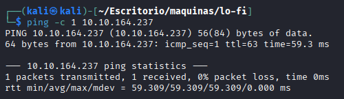
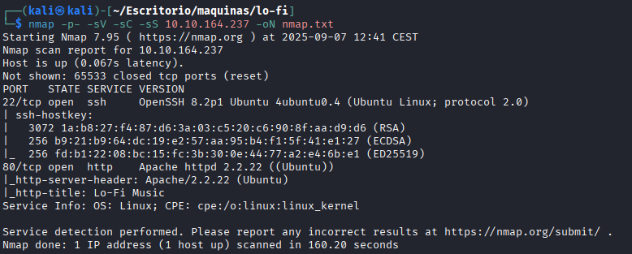
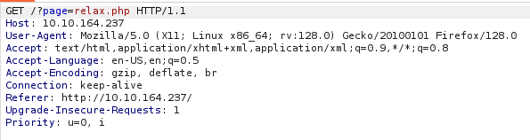
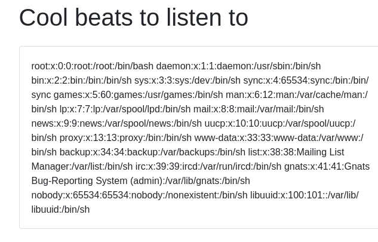

# Lo-Fi
[](README.md) [](README.es.md)

## Dificultad: Fácil


Tenemos que encontrar solo una bandera.

Empiezo haciendo un ping:

```
ping -c 1 10.10.164.237
```



Tenemos conectividad. Por el ttl cercano a 64, sabemos que es un Linux. Sé que se puede modificar el valor, pero las máquinas fáciles en TryHackMe no lo hacen. 

Uso nmap para ver los puertos abiertos y guardo el resultado en nmap.txt:

```
nmap -p- -sV -sC -sS 10.10.164.237 -oN nmap.txt
```



Tiene el puerto 22 (SSH) y el puerto 80 (HTTP). Como no tengo las credenciales para entrar por SSH. Vamos a ver qué hay en la web mientras uso gobuster.


Gobuster no me ha encontrado nada que pueda usar. Solo ha encontrado las distintas páginas que ya tenemos enlazadas en el index de todos modos.

Acceso a una de las páginas enlazadas y me llama la atención la URL:


Creo que lo que va detrás del = es la dirección interna que busca la petición GET HTTP que mandamos. Vamos a interceptar una petición con Burp Suite para verlo.

Abro Burp Suite, configuro el proxy en el navegador:


Activo el Intercept y mandamos la petición:



Sí, creo que después del = busca la ruta al archivo cuando le mandas la petición, vamos a intentar un Path Traversal. El más básico de ir para atrás con ../




Funciona. No hay ningún usuario que tenga un /home. Llegados a este punto, intenté ver si me dejaba intentar contraseñas por ssh, con el usuario root, pero me negaba el acceso sin siquiera dejarme introducir contraseñas. 

Intenté leer /etc/shadow con el mismo Path Traversal para ver si somos root. Salió una página en blanco lo que significa que no somos root y no nos deja leerlo.

Sabiendo que hay que encontrar una bandera, seguramente se llame algo como flag.txt flag1.txt user.txt root.txt (en caso de que esté en /root) suele ser alguna de esas. Y estará, o en el directorio base del servidor, en algún /home pero en este caso no porque no hay usuarios con /home. En / o en /root. 

Como no tenemos root, lo quehe hecho a sido probar estas combinaciones menos la de /root manualmente. Hasta que la encontré en /flag.txt


