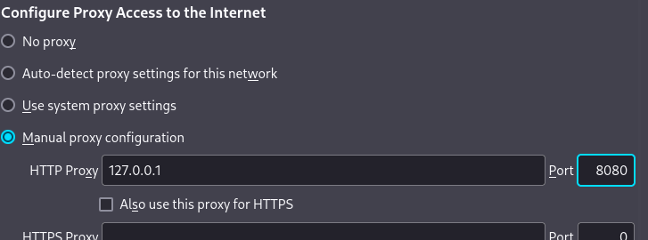
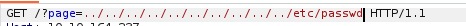
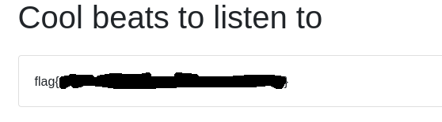

# Lo-Fi
[](README.md) [](README.es.md)

## Difficulty: Easy


We just need to find one flag.

I start with a ping:
```
ping -c 1 10.10.164.237
```


We have connection.  I know this value can be changed, but Easy TryHackMe machines don't do that.

I use nmap to see open ports and save the result on nmap.txt:

```
nmap -p- -sV -sC -sS 10.10.164.237 -oN nmap.txt
```


It has the port 22 (SSH) and 80 (HTTP) opened. Since I don't have the credentials to log in via SSH, let's see what's on the website while using GoBuster.


Gobuster didn't find nothing usefull. Just the pages in the index.

I access one of the linked pages and the URL catches my attention:


I think what's behind the = is the internal address that the HTTP GET request we sent is looking for. Let's intercept a request with Burp Suite to see it.

I open Burp Suite, configure the proxy in the browser:



I activate the Intercept and send the request:


Yes, I think after the = it looks for the path to the file when you send the request, so let's try a path traversal. The most basic one: To go back with ../




It's works. There is no a /home user. I tried to see if it would let me try passwords via ssh, with the root user, but it denied me access without even letting me enter passwords.

I tried reading /etc/shadow with the same path traversal to see if we're root. It showed a blank page, which means we're not root and won't let us read it.

Knowing that just need to find a flag, it's probably called something like flag.txt, flag1.txt, user.txt, root.txt (if it's in /root), one of those. It'll be either in the server's home directory or in /home, but in this case, because there are no users with /home. It'll be in / or /root.

Since I don't have root, I tried these combinations except for the /root one manually. Until I found it in /flag.txt


