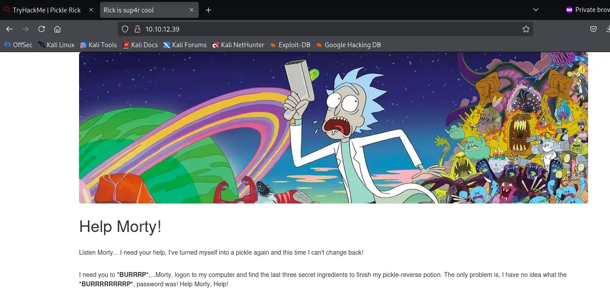

# Pickle Rick

[](README.md) [](README.es.md)


Este es un CTF de nivel fácil, dónde tenemos que comprometer un servidor web y encontrar tres banderas.

Empiezo haciendo un ping para comprobar que tenemos conexión con el servidor:


Tenemos conexión. Además, como el ttl es cercano a 64, sabemos que el objetivo es una máquina Unix, probablemente un Linux.

Accedo a la web con el navegador:



Podemos ver que usa el protocolo HTTP, por tanto, el servidor probablemente esté usando el puerto 80. Vamos a analizar el código fuente de la página:


Encontramos el nombre de usuario en un comentario. No hay nada más a simple vista, vamos a buscar directorios ocultos con **Gobuster**, especificando que busque también archivos php, html y txt.

```bash
gobuster dir -w /usr/share/wordlists/dirbuster/directory-list-2.3-medium.txt -u http://10.10.12.39 -x php,html,txt
```


Hay varios directorios ocultos. Particularmente interesantes son robots.txt y login.php. Vamos a robots.txt:


Hay un texto extraño que no forma parte de un fichero robots.txt normal. Tal vez sea la contraseña. Lo guardaré.

Ahora vamos a login.php, y efectivamente está el portal de login. Pruebo el usuario y contraseña que encontramos:


¡Funciona! Ya tenemos acceso al servidor. Tenemos una terminal en la que podemos usar comandos. Usaré **pwd** para ver el directorio actual:


Ahora **ls** para listar el contenido del directorio:


Ahí está uno de los ingredientes. Intento leerlo con **cat** pero ese comando está bloqueado. Intento usar **nano** pero también está bloqueado. Pruebo con **less** y funciona:


Ya tenemos el primer ingrediente. Ahora leo el contenido de clue.txt:


Tenemos una pista, nos indica que busquemos en el sistema de archivos. Pruebo a ver que hay en /home. Hay dos directorios, uno llamado Rick y otro llamado ubuntu. Busco en el de rick y encuentro el segundo ingrediente:


Lo leo con **less**, pero como hay un espacio tenemos que **escaparlo**:


Busqué en /home/ubuntu pero no había nada relevante. Pruebo si puedo escalar privilegios con **sudo** y funciona, ni siquiera necesito contraseña, pudiendo mirar en /root:


Ahora lo leo con **less:**


Y con esto ya tenemos todos los ingredientes y hemos completado la máquina:


