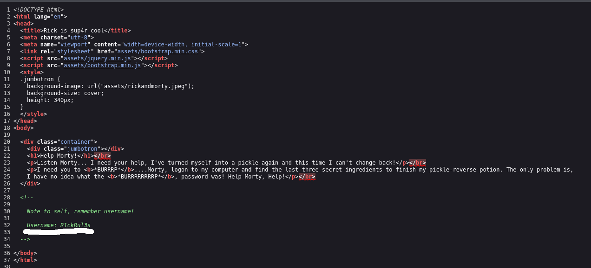
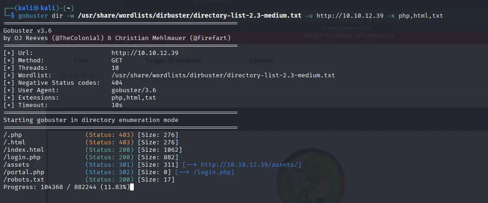

# Pickle Rick


Este es un CTF de nivel fácil, dónde tenemos que comprometer un servidor web y encontrar tres banderas.

Empiezo haciendo un ping para comprobar que tenemos conexión con el servidor:


Tenemos conexión. Además, como el ttl es cercano a 64, sabemos que el objetivo es una máquina Unix, probablemente un Linux.

Accedo a la web con el navegador:


Podemos ver que usa el protocolo HTTP, por tanto, el servidor probablemente esté usando el puerto 80. Vamos a analizar el código fuente de la página:



Encontramos el nombre de usuario en un comentario. No hay nada más a simple vista, vamos a buscar directorios ocultos con **Gobuster**, especificando que busque también archivos php, html y txt.

```bash
gobuster dir -w /usr/share/wordlists/dirbuster/directory-list-2.3-medium.txt -u http://10.10.12.39 -x php,html,txt
```

