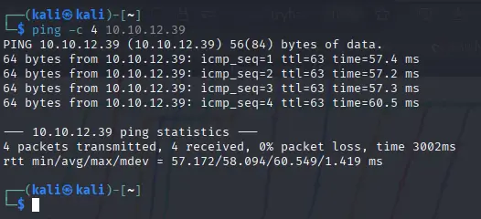
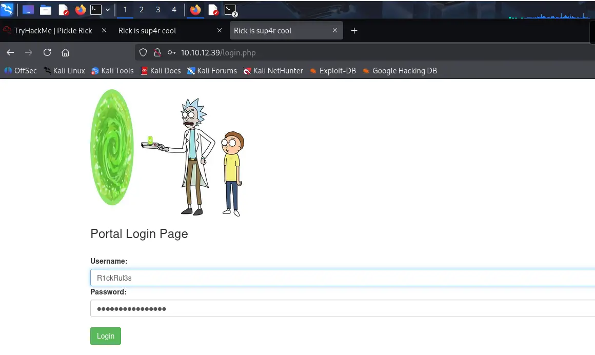
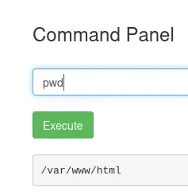
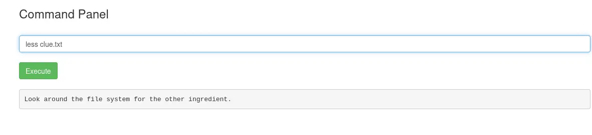
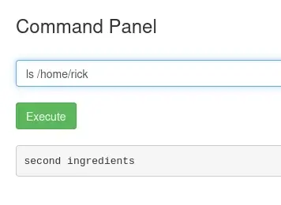
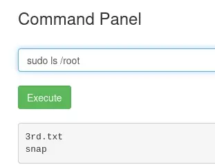

# Pickle Rick
[](README.md) [](README.es.md)


## Difficulty: Easy

We need to compromise a Web Server and get three flags.

I start with a ping:



We have conecction. Also, because the ttl is close to 64. It's probably an Unix Machine.

I access the website with the browser:


We can see that it uses the HTTP protocol, so the server is probably using port 80. Let's analyze the page's source code:


The username is in a comment. I can see nothing more usefull. I use **Gobuster** to search for hidden directories.

```bash
gobuster dir -w /usr/share/wordlists/dirbuster/directory-list-2.3-medium.txt -u http://10.10.12.39 -x php,html,txt
```


It found some hidden directories. **robots.txt** and **login.php** are interesting.  


There's a strange text that isn't part of a normal robots.txt file. Maybe it's the password. I'll save it.

Now I go to login.php, and found the Login Portal. I test the username and password that we found and worked:



We have a terminal where we can use commands. I use **pwd** to see the current directory:



Now **ls** to list the content of the current directory:


There's one of the ingredients. I tried to read it with **cat**, but that command is blocked. I tried to use **nano**, but that's also blocked. I tried to use **less**, and worked:


We have the first ingredient. Now I read the contents of clue.txt:



We have a clue; it tells us to search the file system. I tried to see what's in /home. There are two directories, one called Rick and the other called Ubuntu. I searched in Rick's directory and found the second ingredient:



I read it with **less**, but since there is a space we have to **escape it**:


I searched /home/ubuntu but didn't found nothing usefull. I tested whether I could escalate privileges with **sudo** and it worked. I didn't even need a password, and I could just look in /root:



Now I read it with **less**: 


I found all the flags and finished the machine with success:


