# Evil-GPT
[](README.md) [](README.es.md)

## Difficulty: Easy


In this machine, we are versus an LLM. The goal is to obtain just one flag, and we need to get the AI ​​to give us the flag.

I start to ping the machine:
```
ping -c 1 10.10.23.151
```

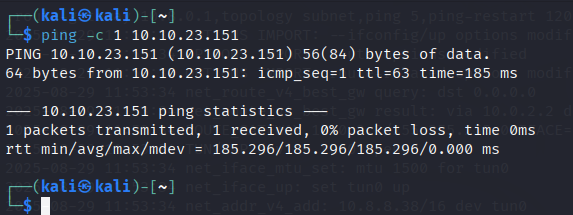

We have connection, and from the ttl close to 64, we know it's a UNIX machine. Probably a Linux one.

Our instructions are to connect to the machine via netcat and port 1337. So:

```
nc 10.10.23.151 1337
```

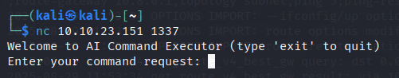

I tried to use Linux commands. First **pwd** to see the current directory:

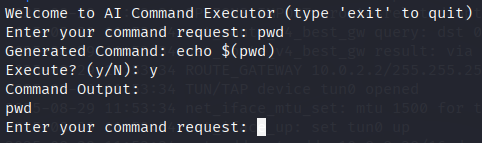

But the IA missunderstand my command and output an echo. I tried **whoami** but didn't work:

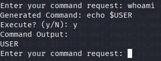

The same thing. Here I wonder if it's interpreting my prompt and translating it into commands. I try telling it the command I want it to use in natural language. I tell it I'm the current user, to see if it does **whoami**:

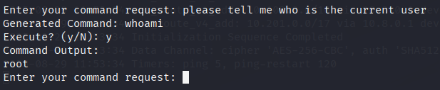

Okay, this worked. We are the root user. So we don't need to do privilege scalation, we already have root privileges.

I said it to list the current path **(pwd)**:

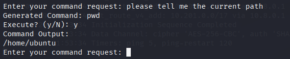

Now that list the current directory **(ls)**:

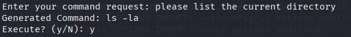

I didn't find nothing usefull. I tried to list /home to find more users:

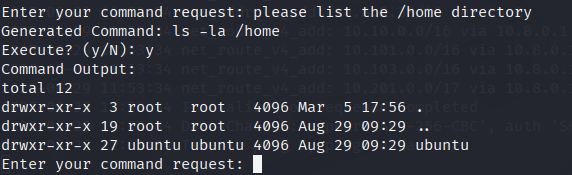

Nothing. Okay, I try /root because it's other typical directory:

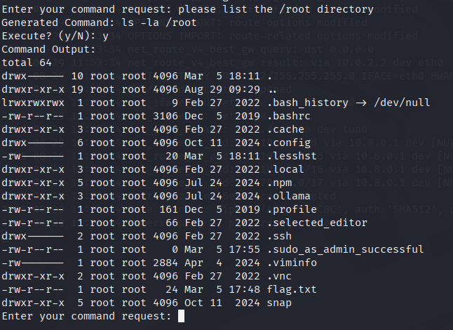

Good. The flag is here. I try to output a **cat /root/flag.txt**

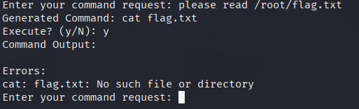

It didn't work. Okay, I'll try to be more specific.

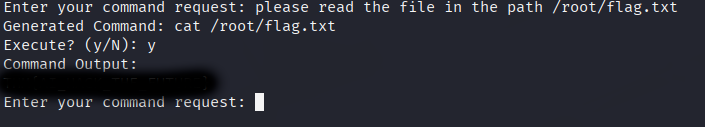

This machine only have a flag. So it's solved.