# LazyAdmin
[](README.md) [](README.es.md)

## Dificultad: Fácil


Empezamos haciendo un ping para comprobar la conectividad:

```
ping -c 1 10.10.176.70
```

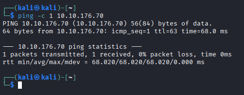

Tenemos conexión, y por el ttl cercano a 64, es una máquina UNIX, probablemente un Linux.

Ahora usamos nmap para buscar puertos abiertos:

```
nmap -p- -sV -sC -sS -vvv 10.10.176.70
```

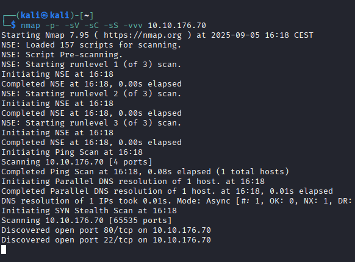

Tiene abiertos el puerto 80 (HTTP) y el 22 (SSH). Por tanto es un servidor web. Vamos a acceder a la web.

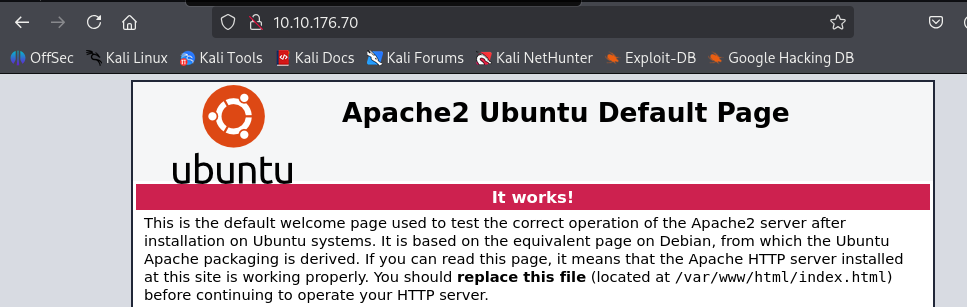

Es lo que muestra Apache por defecto. Entonces es un apache.

Lanzo gobuster para buscar directorios ocultos:

```shell
gobuster dir -w /usr/share/wordlists/dirbuster/directory-list-2.3-medium.txt -u http://10.10.176.70/ -x txt,js,html,php
```

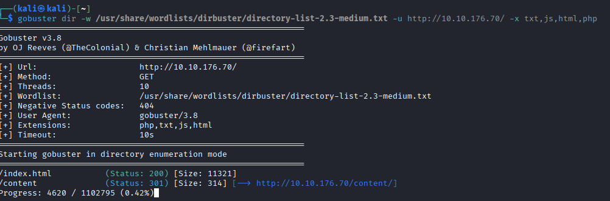

En content tenemos esto:

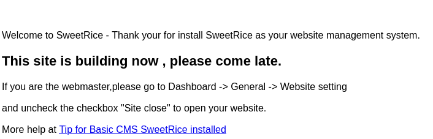

Parece que esta web usa un CMS llamado SweetRice, del que nunca había oído hablar antes.

No parece haber nada más, voy a lanzar gobuster iterando sobre  /content a ver si nos lleva a alguna parte:

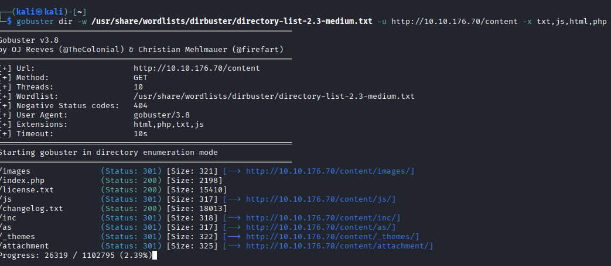

En /content/inc encuentro un index con ficheros del servidor:

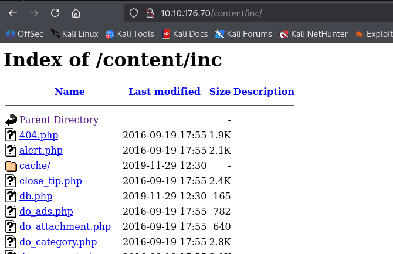

Buscando en el index, encuentro un backup de una base de datos SQL. Obviamente en una base de datos puedes encontrar todo tipo de información confidencial, por tanto la descargo.

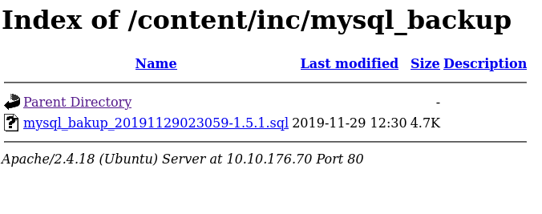

En /content/as encuentro el Portal de Login:

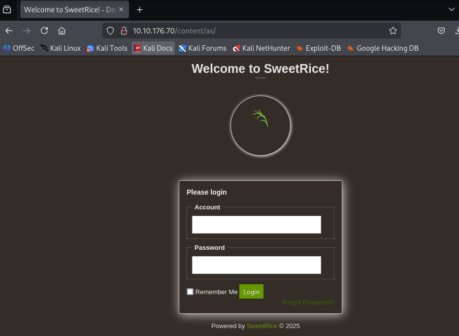

Abro la base de datos con un editor de texto, cualquiera que haya trabajado con Bases de Datos SQL sabe que el fichero .sql se puede leer en texto plano. Es la creación de una tabla MySQL, la línea interesante es esta:

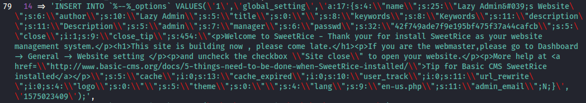

Vemos que es un INSERT. Y, si nos fijamos, tenemos que admin es "manager" y passwd es, ese número largo. Lo primero que hago es probar las credenciales tal cual, no funciona. Luego abro Cyberchef a ver si está codificado, pero no consigo sacar nada. La otra opción que se me ocurre es que sea un hash.

Uso hashid, que nos dice de mayor a menos que tipo de hash es más probable que sea, si es un hash.

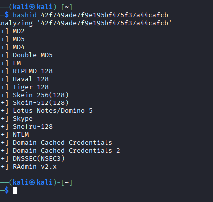

La idea ahora es usar John the Ripper con la lista rockyou.txt, e ir probando los distintos  tipos de hashes a ver si logramos crackear la contraseña por fuerza bruta.

Primero creo un fichero y escribo en el el hash con un echo:

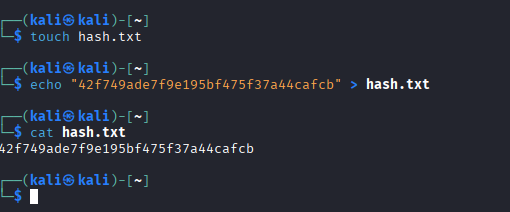

Ahora probamos con John the Ripper. Primero probé con md2 pero no conseguí nada, después con md5 y ya funcionó:

```
john --wordlist=/usr/share/wordlists/rockyou.txt --format=raw-md5 hash.txt
```

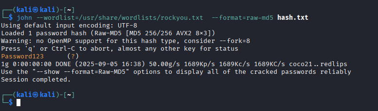

Nos ha sacado la contraseña. La pruebo junto con "manager" como usuario, y funciona:

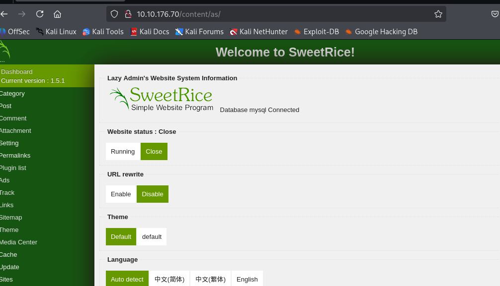

Veo que la versión de SweetRice es 1.5.1 busco en Google si tiene vulnerabilidades conocidos, y es vulnerable a Arbitrary File Upload. Por tanto sabiendo eso y que tiene muchos directorios accesibles desde fuera, deberíamos poder montarnos una shell inversa para acceder por terminal.


He utilizado la Shell Inversa en PHP de [pentestmonkey](https://github.com/pentestmonkey/php-reverse-shell) 

Solo tenemos que cambiar la IP por la de nuestra máquina, y el puerto por el que queramos escuchar. Para saber nuestra IP simplemente usamos el comando **ip a**. He usado el puerto 4444, pero cualquiera que no esté ocupado vale.

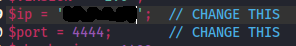

Pongo netcat a escuchar por el puerto 4444:

```shell
nc -lvnp 4444
```

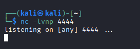

Ahora necesitamos subir la shell inversa y mandarle una petición GET para que el servidor active el script y podamos tener la shell inversa. Intento subir el fichero en distintos sitios, lo intenté en media, haciendo un post, pero no me dejaba subirlo, probé con otras extensiones y sí me dejaba, por tanto el problema es que no permite subir ficeros .php

Seguí buscando y en Ads, vi que se podía subir código:

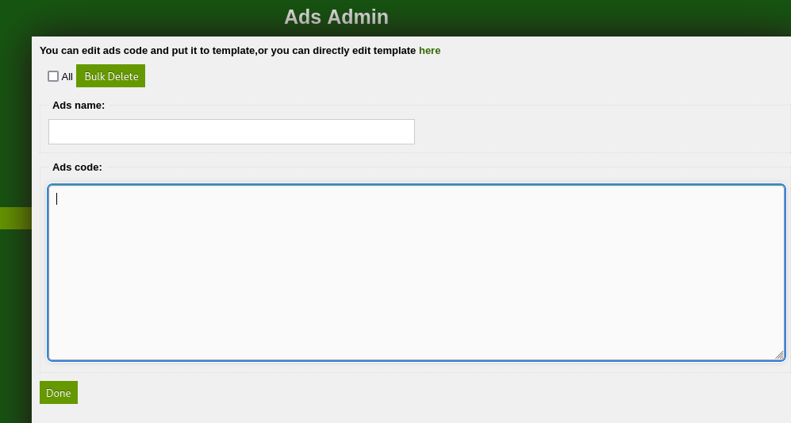

Decido pegar el script aquí a ver si se sube a algún lado accesible.

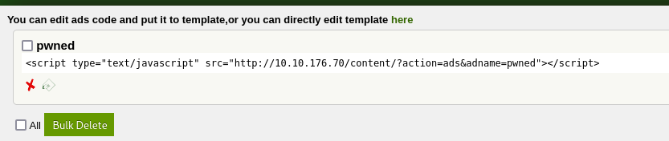

Se ha subido, ahora a ver si está accesible.

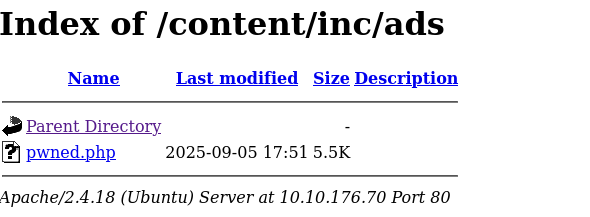

Hago click para mandar la petición GET al servidor. Y funciona, ya tengo acceso desde la terminal con la que estábamos escuchando con netcat:

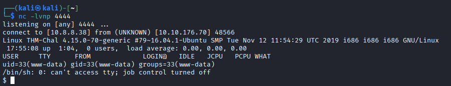

Ahora tenemos una shell básica de netcat, pero queremos convertirla en una TTY, con más funcionalidades. Para ello usamos el siguiente comando de Python:

```shell
python -c 'import pty; pty.spawn("/bin/bash")'
```

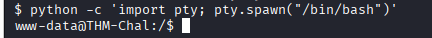

Con un **whoami** vemos que no somos root. En /home está el usuario itguy, y en /home/itguy está la primera bandera:

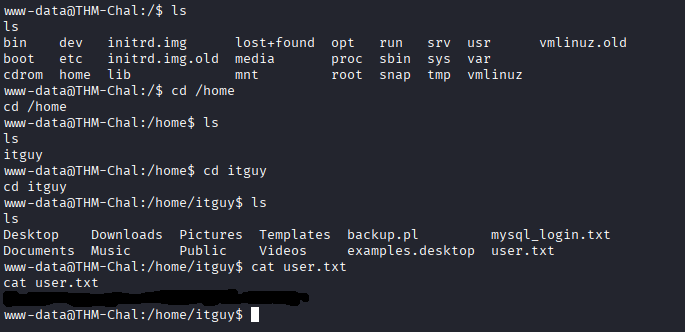

Uso **sudo -l** para ver que permisos tengo:

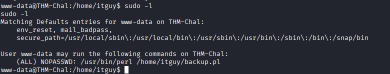

Podemos ejecutar con permisos de sudo /usr/bin/perl /home/itguy/backup.pl

Vamos a ver el contenido de /home/itguy/backup.pl:

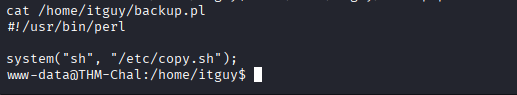

Basicamente ejecuta un script en bash localizado en /etc/copy.sh

Vamos a ver su contenido:

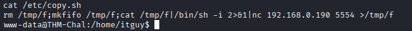

Vale, esto crea una shell inversa en bash. Ahora quiero saber que permisos tengo, voy a usar **ls -l** para verlo:

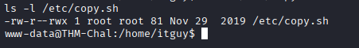

Wow, tenemos literalmente más permisos que el dueño del fichero. En cualquier caso, tenemos permiso de escritura, que es lo que me interesa.

Entonces, para escalar privilegios, recordemos que los procesos hijos heredan los permisos del padre, por tanto, al ejecutar el primer script de la cadena con permisos de root, al usar sudo, acabaremos teniendo una shell en  bash con permisos de root.

Entonces, podemos usar el puerto por defecto del script, el 5554, porque mientras esté libre da igual, pero la IP debe ser la de nuestra máquina. Lo que hago es, copiar el script con ctrl + shift + c. Modificarlo en un editor de texto, y pegarlo como el contenido de un echo que mandamos al script con >.

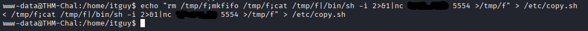

Nos ponemos a esuchar en el puerto 5544

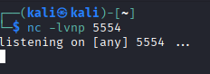

Ejecutamos el primer script de la cadena con sudo:

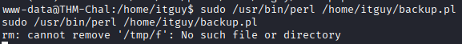

**¡Funciona!**:

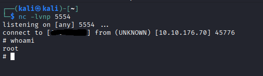

Ya está, ahora ya simplemente vamos a /root a leer la bandera:

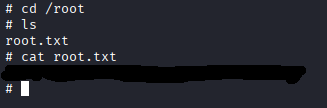
